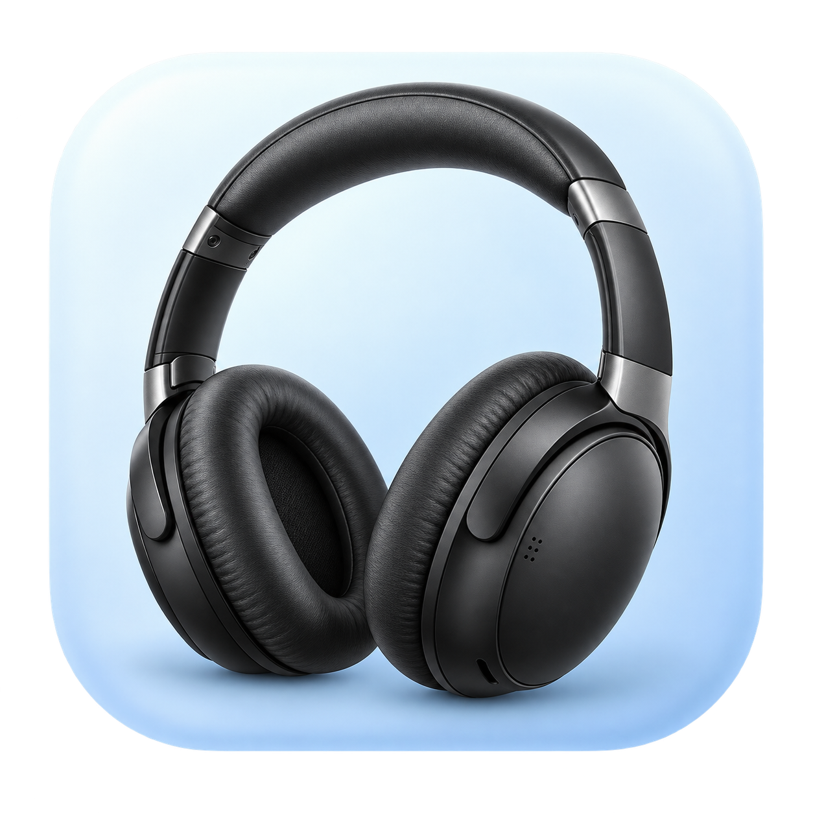

# Bose Utility

<p align="center">
  
</p>

Created by Arnold Roa.

A macOS menu bar app for viewing and managing your Bose headphones' device connections and adjusting noise cancellation.

## Open the app

The installed app is located at `~/Applications/Bose Utility.app`. Open it from Finder or search for **Bose Utility** in Spotlight.

The 🎧 icon appears in the menu bar. The app does not need a main window or a permanent Dock icon.

## Connect your headphones

1. Turn on your Bose headphones and pair them with your Mac in System Settings → Bluetooth.
2. Open Bose Utility and allow Bluetooth access if macOS asks.
3. Click 🎧 → **Select headphones** and choose your Bose headphones.
4. A **✓** marks the selected headphones. Their status shows **Connecting…**, **Connected**, **Disconnected**, or **Connection failed**.
5. Wait a few seconds, then open **Headphone connections**.

If exactly one Bose device is already connected to your Mac at startup, the app selects it automatically. Otherwise, select it manually. Select headphones lists devices paired with your Mac; appearing in this list does not guarantee compatibility.

## Manage device connections

**Headphone connections** lists the computers and phones saved in your headphones' memory. This is separate from the Mac's paired Bluetooth device list.

- **✓** marks a connected source.
- **(connected)** identifies a connected source.
- **(this Mac)** identifies the Mac maintaining the control connection.
- Choose a source, then click **Connect** or **Disconnect**.
- Click **Refresh connections** to reload the list and connection states.

For example, to disconnect an unwanted computer: 🎧 → Headphone connections → computer name → Disconnect. Then select another source → Connect.

Connection-changing commands are sent only when you choose Connect or Disconnect. Selecting headphones or refreshing the list does not send commands to change audio connections to other sources.

To add a new phone or computer, first pair your headphones using that device's Bluetooth settings. Bose Utility does not create new pairings or delete saved ones.

The target device must be powered on, within range, and have Bluetooth enabled. If your headphones have reached their connection limit, disconnect a source before connecting another. Disconnecting **this Mac** may also close the control connection; select your headphones again to restore it.

## Noise cancellation

Click 🎧 → **Noise cancellation**, then choose:

- **Off**: disable noise cancellation.
- **Medium**: use the lower noise cancellation setting.
- **High**: use the higher noise cancellation setting.

An active headphone control connection is required to send these commands.

## About and Quit

**About Bose Utility** opens the app information panel and displays **Created by Arnold Roa**.

**Quit** closes the utility and its Bluetooth control channel.

## Troubleshooting

### Headphones are missing from Select headphones

Check that they are paired with your Mac, then click **Refresh headphones**. The app does not discover devices that have not been paired.

### No compatible Bose service found

The app could not find a compatible control service. It recognizes both the `SPP Dev` service name and the Bluetooth Serial Port identifier (`0x1101`), since some QC35 II headphones advertise an unnamed service. Check that you are running the current app and selecting the correct headphones. Other models may require a different protocol.

### Connections are missing, an error appears, or a request times out

Read the message under **Headphone connections**. Check that your headphones are powered on and connected to your Mac, then select them again in **Select headphones**.

**Refresh headphones** updates the Mac's local device list. **Refresh connections** queries the sources saved in the headphones.

If Bluetooth access was denied, check System Settings → Privacy & Security → Bluetooth. If another app is using the control channel, close it and reconnect.

### Change not confirmed

The command did not receive the expected acknowledgment. Click Refresh connections to check the actual state before trying again. Sending a command alone is not treated as confirmation of success.

### Diagnostic logs

In macOS Console, look for subsystem `lukasz-zet.bose-macos-utility` and category `Connection`. Logs include service discovery, channel opening, write results, and response types. This subsystem is an internal identifier retained for continuity.

From Terminal:

```sh
/usr/bin/log show --last 10m --style compact \
  --predicate 'subsystem == "lukasz-zet.bose-macos-utility" AND category == "Connection"'
```

## Compatibility and validation

Tested with **Bose QC35 II** headphones: unnamed service detection, RFCOMM channel 8 opening, initialization, and retrieval of three saved devices and their details. Connect/Disconnect packet formats have automated checks; their effects still require physical-device testing. Compatibility with other models or firmware versions is not guaranteed.

The Swift implementation uses the BMAP protocol. No third-party runtime dependencies are required, and the app does not need an Internet connection to operate.

## Build from source

Install Xcode and configure its developer tools. From the repository root:

```sh
xcodebuild -project bose-macos-utility/bose-macos-utility.xcodeproj \
  -scheme bose-macos-utility -configuration Release -derivedDataPath build \
  CODE_SIGN_IDENTITY=- CODE_SIGN_STYLE=Manual build
open build/Build/Products/Release/bose-macos-utility.app
```

The local build uses ad hoc signing. To install it under its display name:

```sh
mkdir -p "$HOME/Applications"
ditto build/Build/Products/Release/bose-macos-utility.app \
  "$HOME/Applications/Bose Utility.app"
open "$HOME/Applications/Bose Utility.app"
```

Quit the previous copy before opening an update to avoid running two instances.

## License

See [LICENSE](LICENSE) for the applicable license. Bose Utility is an independent app and is not an official Bose product. Bose trademarks belong to Bose Corporation.

## Protocol tests

Run the standalone checks for command encoding, malformed payloads, device information, and fragmented or combined Bluetooth responses:

```sh
mkdir -p build/protocol-cache
swiftc -module-cache-path build/protocol-cache \
  bose-macos-utility/bose-macos-utility/NSMenuExtended.swift \
  tests/main.swift -o build/protocol-tests
build/protocol-tests
```
